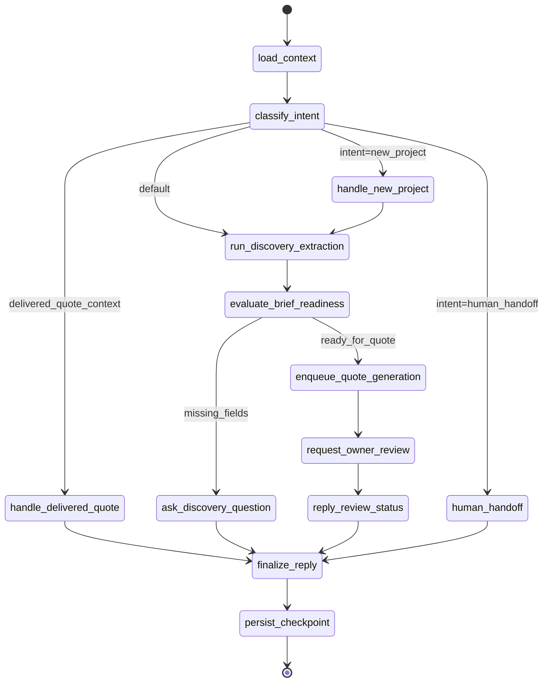

# LangGraphJS Architecture Spec (SNL-51)

## Objective

Migrate the current ai-sales conversational orchestration from imperative service branching to a deterministic LangGraphJS runtime with persisted checkpoints, typed tools, and production observability.

Scope:
- WhatsApp/webchat inbound flow.
- Discovery -> quote prep -> owner review -> delivered follow-up -> human handoff.
- Backward-compatible rollout behind a feature flag.

## Existing Runtime Mapping

Current modules mapped to graph concerns:
- `ConversationFlowService`: entrypoint intent handling + reply planning.
- `AiSalesOrchestrator`: quote generation pipeline (`extractCommercialBrief`, `createQuoteDraftFromTranscript`).
- `OwnerReviewService`: owner review lifecycle.
- `MessagingService`: outbound delivery.
- `ConversationsService`: transcript/history retrieval.
- `PrismaService`: durable business state (`commercialBrief`, `quoteDraft`, messages).

## Graph Contract

### State Schema

```ts
export type SalesGraphState = {
  conversationId: string;
  inboundMessageId: string;
  inboundBody: string | null;
  channel: 'whatsapp' | 'webchat';

  intent:
    | 'new_project'
    | 'clarification'
    | 'quote_status'
    | 'discovery'
    | 'post_delivery'
    | 'human_handoff'
    | 'unknown';

  transcript: string;
  briefId?: string;
  briefStatus?: 'collecting' | 'ready_for_quote' | 'quote_in_review';
  missingFields: string[];

  quoteDraftId?: string;
  quoteDraftVersion?: number;
  quoteReviewStatus?:
    | 'pending_owner_review'
    | 'changes_requested'
    | 'approved'
    | 'delivered_to_customer';

  escalationReason?: string;
  shouldNotifyHuman: boolean;
  responseBody?: string;

  retries: Record<string, number>;
  lastError?: string;
  traceId: string;
  startedAt: string;
};
```

### Node Inventory

- `load_context`: hydrate conversation + latest brief/draft + config flags.
- `classify_intent`: classify current inbound intent.
- `handle_new_project`: archive prior context and reset brief scope safely.
- `run_discovery_extraction`: extract/update brief fields from transcript.
- `evaluate_brief_readiness`: decide missing fields vs quote-ready.
- `ask_discovery_question`: generate next targeted discovery question.
- `enqueue_quote_generation`: create or refresh quote draft generation execution.
- `request_owner_review`: trigger owner review and mark status.
- `reply_review_status`: send status-aware response while draft is in review.
- `handle_delivered_quote`: post-delivery responses (questions/pdf/acceptance/handoff).
- `human_handoff`: notify human channel and stop auto-handling.
- `finalize_reply`: produce outbound payload.
- `persist_checkpoint`: persist terminal state + transition metrics.

### Tool Adapters (Typed)

- `conversationTool`: list/load messages and timeline markers.
- `briefTool`: upsert brief, archive old project context, load latest brief/draft.
- `quoteTool`: generate quote draft, request owner review, fetch review status.
- `notifyTool`: send outbound WhatsApp/webchat messages.
- `escalationTool`: send email/slack/internal alert.
- `metricsTool`: emit transition/failure/retry telemetry.

All tools return discriminated union results:

```ts
type ToolResult<T> = { ok: true; data: T } | { ok: false; code: string; retryable: boolean; message: string };
```

## Deterministic Routing Guards

Guard rules (non-exhaustive):
- If explicit new-project intent -> `handle_new_project`.
- If delivered draft exists and inbound relates to follow-up -> `handle_delivered_quote`.
- If review in progress -> `reply_review_status`.
- If missing core brief fields -> `ask_discovery_question`.
- If brief ready and no active quote generation lock -> `enqueue_quote_generation`.
- If frustration/off-topic/compliance-risk detected -> `human_handoff`.

## Interrupt Points

Interrupt node boundaries for operator or admin controls:
- Before `enqueue_quote_generation`.
- Before `request_owner_review`.
- Before `human_handoff` final notification.

Each interrupt serializes state + transition cause to allow manual resume.

## Checkpointing Strategy

- Thread key: `conversationId`.
- Checkpoint after every node transition and before external side effects.
- Idempotency key: `inboundMessageId` + node name.
- Resume semantics: restart from latest committed checkpoint; re-run only retryable node.

## Observability Contract

Emit structured event per transition:

```json
{
  "event": "sales_graph_transition",
  "conversationId": "...",
  "traceId": "...",
  "fromNode": "...",
  "toNode": "...",
  "status": "success|retry|fallback|error",
  "latencyMs": 0,
  "tool": "optional-tool-name",
  "errorCode": "optional"
}
```

Hard requirements:
- Correlate all events by `conversationId` and `traceId`.
- Track retries, fallbacks, handoff counts, and unresolved failure exits.

## Rollout Plan

- Feature flag: `AI_SALES_LANGGRAPH_ENABLED`.
- Phase 1: shadow mode (run graph + legacy path, respond with legacy).
- Phase 2: partial rollout by channel/tenant/percentage.
- Phase 3: full cutover + legacy code retirement.

## Initial Work Slices

1. Runtime scaffold + state/type contracts.
2. Checkpoint persistence + idempotent re-entry.
3. Typed tools + retry/fallback policy.
4. Transition telemetry + dashboards.
5. Shadow mode and cutover toggles.
6. Test matrix (unit transitions + integration resume/error scenarios).

## Mermaid State Diagram


